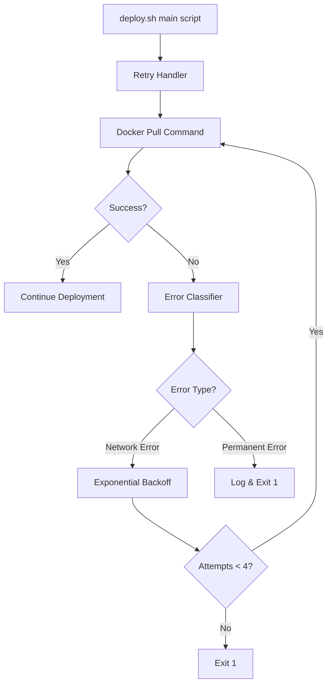
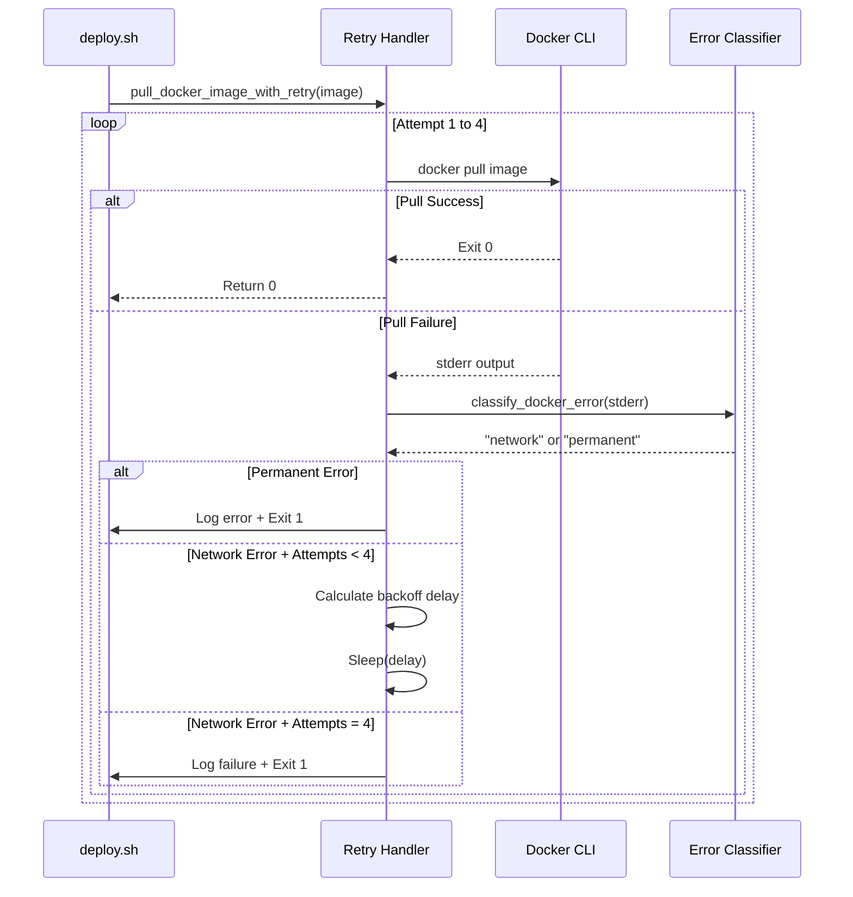

# Design Document: Smart Docker Pull Retry Mechanism

## Overview

This design describes an enhanced retry mechanism for Docker pull operations in the deployment script (`scripts/deploy.sh`). The current implementation blindly retries all Docker pull failures, including permanent errors like authentication failures. This enhancement adds intelligent error classification to distinguish between transient network errors (which should be retried) and permanent errors (which should fail fast), reducing deployment time and providing clearer feedback.

### Goals

- **Intelligent Error Classification**: Distinguish between transient network errors and permanent configuration errors
- **Fail Fast**: Exit immediately on permanent errors to provide quick feedback
- **Exponential Backoff**: Retry transient errors with increasing delays (5s → 10s → 20s)
- **Detailed Logging**: Provide clear visibility into retry behavior and error types
- **Pure Bash**: No external dependencies beyond standard bash and Docker CLI
- **Backward Compatible**: Preserve existing deployment script behavior and exit codes

### Non-Goals

- Retrying errors from docker-compose commands (scope limited to docker pull)
- Implementing circuit breakers or advanced retry patterns
- Supporting other container registries beyond GHCR
- Creating a reusable retry library for other scripts

## Architecture

### Component Overview



### Key Components

1. **Error Classifier Function** (`classify_docker_error`)
   - Input: Docker pull stderr output
   - Output: "network" or "permanent"
   - Responsibility: Pattern matching against known error messages

2. **Retry Handler Function** (`pull_docker_image_with_retry`)
   - Input: Full image name (e.g., `ghcr.io/org/repo:tag`)
   - Output: Exit code (0 for success, 1 for failure)
   - Responsibility: Orchestrate retry loop with backoff logic

3. **Configuration Variables**
   - `MAX_PULL_RETRIES`: Maximum retry attempts (default: 3)
   - `BACKOFF_BASE_DELAY`: Base delay in seconds (default: 5)
   - Defined at the top of deploy.sh for easy tuning

## Components and Interfaces

### 1. Error Classifier Function

**Function Signature:**
```bash
classify_docker_error() {
    local error_output="$1"
    # Returns: "network" or "permanent" via echo
}
```

**Error Classification Rules:**

| Error Pattern | Classification | Rationale |
|--------------|----------------|-----------|
| `i/o timeout` | network | Transient TCP/network timeout |
| `TLS handshake timeout` | network | Transient SSL/TLS negotiation timeout |
| `connection reset` | network | Network connection interrupted |
| `context deadline exceeded` | network | Transient timeout from Docker context |
| `EOF` | network | Unexpected end of file during network operation |
| `manifest unknown` | permanent | Image/tag doesn't exist in registry |
| `unauthorized` | permanent | Authentication credentials invalid |
| `denied` | permanent | Authorization/permissions issue |
| `pull access denied` | permanent | Pull access denied (specific GHCR error) |
| *default* | network | Conservative default (retry unknown errors) |

**Implementation Approach:**
- Use `grep -q` for pattern matching (exit code 0 if match found)
- Test patterns in order of specificity (permanent errors first)
- Return "permanent" on match, otherwise return "network"
- Case-insensitive matching to handle varying Docker output formats

### 2. Retry Handler Function

**Function Signature:**
```bash
pull_docker_image_with_retry() {
    local image="$1"
    # Returns: Exit code 0 on success, 1 on failure
}
```

**Retry Logic Flow:**



**Retry Attempt Structure:**
- **Total Attempts**: 4 (1 initial + 3 retries)
- **Attempt 1**: Initial pull with no delay
- **Attempt 2**: First retry after 5-second delay
- **Attempt 3**: Second retry after 10-second delay
- **Attempt 4**: Third retry after 20-second delay

**Exponential Backoff Calculation:**
- Formula: `delay = BACKOFF_BASE_DELAY * (2^(attempt-2))` for attempt ≥ 2
- Attempt 1: No delay (initial attempt)
- Attempt 2: 5 * 2^0 = 5 seconds
- Attempt 3: 5 * 2^1 = 10 seconds
- Attempt 4: 5 * 2^2 = 20 seconds
- Total max wait time: 35 seconds across all retries

### 3. Integration with Existing deploy.sh

**Current Code (Lines 47-73):**
```bash
MAX_PULL_RETRIES=3
PULL_RETRY=0
PULL_SUCCESS=false

while [ $PULL_RETRY -lt $MAX_PULL_RETRIES ]; do
    if docker pull "${FULL_IMAGE}"; then
        PULL_SUCCESS=true
        break
    fi
    # ... retry logic
done
```

**Enhanced Code:**
```bash
# Configuration at top of script
MAX_PULL_RETRIES=3
BACKOFF_BASE_DELAY=5

# Function definitions after color constants
classify_docker_error() { ... }
pull_docker_image_with_retry() { ... }

# Replace lines 47-73 with simple function call
pull_docker_image_with_retry "${FULL_IMAGE}"
```

**Integration Points:**
- Replace existing retry block (lines 47-73) with single function call
- Preserve color constants (RED, GREEN, YELLOW, NC) for logging
- Maintain same exit codes (0 = success, 1 = failure)
- No changes to environment variable handling or docker-compose logic

## Data Models

### Error Classification State

```bash
# Transient state during retry loop
ATTEMPT_NUMBER=1        # Current attempt (1-4)
ERROR_OUTPUT=""         # Captured stderr from docker pull
ERROR_TYPE=""           # "network" or "permanent"
BACKOFF_DELAY=0         # Calculated sleep time in seconds
```

### Configuration Parameters

```bash
# Defined at script initialization
MAX_PULL_RETRIES=3      # Number of retries after initial attempt (1 initial + 3 retries = 4 total attempts)
BACKOFF_BASE_DELAY=5    # Base delay for exponential backoff (seconds)
FULL_IMAGE=""           # Complete image reference (registry/repo:tag)
```

### Docker Pull Exit Codes

| Exit Code | Meaning | Handler Response |
|-----------|---------|------------------|
| 0 | Success | Return immediately |
| 1 | Generic failure | Classify error and retry/fail |
| 125 | Docker daemon error | Classify as permanent |

## Correctness Properties

Since this feature involves bash script orchestration with external Docker commands, property-based testing is limited in applicability. However, the error classifier function is a pure string classification function that CAN be tested with property-based testing.

### Property 1: Network Error Patterns Are Classified as Retryable

*For any* error message string containing one of the network error patterns (`i/o timeout`, `TLS handshake timeout`, `connection reset`, `context deadline exceeded`, `EOF`), the error classifier SHALL return "network".

**Validates: Requirements 1.2, 1.3, 1.4, 1.5, 1.6**

### Property 2: Permanent Error Patterns Are Classified as Non-Retryable

*For any* error message string containing one of the permanent error patterns (`manifest unknown`, `unauthorized`, `denied`, `pull access denied`), the error classifier SHALL return "permanent".

**Validates: Requirements 1.7, 1.8, 1.9, 1.10**

### Property 3: Unknown Error Patterns Default to Network Classification

*For any* error message string that does not match any known network or permanent error pattern, the error classifier SHALL return "network" by default.

**Validates: Requirements 1.11**

### Property 4: Exponential Backoff Delay Calculation

*For any* attempt number N (where 1 ≤ N ≤ 4), the calculated backoff delay SHALL equal BACKOFF_BASE_DELAY * (2^(N-2)) when N > 1, and 0 when N = 1.

**Validates: Requirements 3.1, 3.2, 3.3, 3.4**

### Property 5: Error Classification Is Case-Insensitive

*For any* error pattern P and any error message M, if M contains P in any case combination (lowercase, uppercase, mixed), the classifier SHALL return the same result as if M contained P in the canonical case.

**Validates: Requirements 1.1** (implicit requirement for robust parsing)

## Error Handling

### Error Categories and Responses

| Error Scenario | Detection | Response | Exit Code | Log Level |
|----------------|-----------|----------|-----------|-----------|
| Authentication failure | "unauthorized" in stderr | Fail immediately, no retry | 1 | RED |
| Manifest not found | "manifest unknown" in stderr | Fail immediately, no retry | 1 | RED |
| Access denied | "denied" in stderr | Fail immediately, no retry | 1 | RED |
| Pull access denied | "pull access denied" in stderr | Fail immediately, no retry | 1 | RED |
| Network timeout | "i/o timeout" in stderr | Retry with backoff | 1 (after max attempts) | YELLOW |
| TLS handshake timeout | "TLS handshake timeout" in stderr | Retry with backoff | 1 (after max attempts) | YELLOW |
| Connection reset | "connection reset" in stderr | Retry with backoff | 1 (after max attempts) | YELLOW |
| EOF error | "EOF" in stderr | Retry with backoff | 1 (after max attempts) | YELLOW |
| All retries exhausted | 4 failed attempts | Log and exit | 1 | RED |

### Logging Strategy

**Log Levels and Colors:**
- **GREEN**: Success messages (pull succeeded, deployment complete)
- **YELLOW**: Informational messages (retry attempts, backoff delays, error type)
- **RED**: Failure messages (permanent errors, exhausted retries)

**Required Log Messages:**

1. **Start of attempt:**
   ```
   Attempt N/4
   docker pull <image>
   ```

2. **Network error detected:**
   ```
   Network timeout detected.
   Retrying in Ns...
   ```

3. **Permanent error detected:**
   ```
   Permanent error detected.
   Retry skipped.
   Deployment aborted.
   ```

4. **Pull success:**
   ```
   Docker image pulled successfully: <image>
   ```

5. **All retries exhausted:**
   ```
   Docker pull failed after 4 attempts
   Make sure the image exists in GHCR: <image>
   ```

### Preserving Original Script Behavior

**Unchanged Behaviors:**
- Exit code 0 on successful pull (any attempt)
- Exit code 1 on failed pull (after retries or permanent error)
- Environment variable validation logic (DB_USER, JWT_SECRET, etc.)
- Docker Compose orchestration (down, up, health checks)
- Color formatting constants and usage patterns

**Changed Behaviors:**
- Faster failure on permanent errors (no retries)
- Different backoff timing (exponential vs linear)
- More detailed error classification logging

## Testing Strategy

### Unit Testing with BATS (Bash Automated Testing System)

Since this is a bash script, we'll use BATS for unit testing the error classifier and retry logic functions.

**Test Categories:**

1. **Error Classification Tests**
   - Test all network error patterns return "network" (i/o timeout, TLS handshake timeout, connection reset, context deadline exceeded, EOF)
   - Test all permanent error patterns return "permanent" (manifest unknown, unauthorized, denied, pull access denied)
   - Test unknown patterns default to "network"
   - Test case-insensitivity of pattern matching
   - Test partial matches and multi-line error messages

2. **Backoff Calculation Tests**
   - Test exponential backoff formula for attempts 1-4
   - Test BACKOFF_BASE_DELAY configuration is respected
   - Test boundary conditions (attempt 0, attempt 5)

3. **Retry Loop Tests** (with mocked docker command)
   - Test success on first attempt (no retries)
   - Test success on second attempt (one retry)
   - Test permanent error exits immediately
   - Test network error exhausts all retries
   - Test correct sleep delays between attempts

**Example BATS Test Structure:**
```bash
# test/deploy_retry_test.bats

@test "classify_docker_error returns network for i/o timeout" {
  source scripts/deploy.sh
  result=$(classify_docker_error "Error: failed to resolve: i/o timeout")
  [ "$result" = "network" ]
}

@test "classify_docker_error returns network for EOF" {
  source scripts/deploy.sh
  result=$(classify_docker_error "Error: unexpected EOF")
  [ "$result" = "network" ]
}

@test "classify_docker_error returns permanent for manifest unknown" {
  source scripts/deploy.sh
  result=$(classify_docker_error "Error: manifest unknown")
  [ "$result" = "permanent" ]
}

@test "classify_docker_error returns permanent for pull access denied" {
  source scripts/deploy.sh
  result=$(classify_docker_error "Error: pull access denied")
  [ "$result" = "permanent" ]
}

@test "exponential backoff for attempt 2 is 5 seconds" {
  BACKOFF_BASE_DELAY=5
  ATTEMPT=2
  DELAY=$((BACKOFF_BASE_DELAY * (2 ** (ATTEMPT - 2))))
  [ "$DELAY" -eq 5 ]
}
```

### Integration Testing

**Test Scenarios:**

1. **Successful Pull on First Attempt**
   - Setup: Valid image in GHCR with authentication
   - Expected: No retries, deployment continues, exit code 0

2. **Transient Network Error with Recovery**
   - Setup: Simulate network timeout on attempt 1, success on attempt 2
   - Expected: 5-second wait, retry succeeds, exit code 0

3. **Permanent Error (Manifest Unknown)**
   - Setup: Request non-existent image tag
   - Expected: Immediate failure, no retries, exit code 1, clear error message

4. **Authentication Failure**
   - Setup: Invalid GITHUB_TOKEN or missing credentials
   - Expected: Immediate failure, no retries, exit code 1, "unauthorized" in log

5. **Exhausted Retries**
   - Setup: Persistent network failure (4 attempts)
   - Expected: Backoff delays (5s, 10s, 20s), final failure, exit code 1

**Integration Test Environment:**
- Docker installed and running
- GHCR authentication configured
- Test image repository with known good/bad tags
- Network simulation tool (optional: `tc` for network delay/drops)

### Property-Based Testing with shUnit2 or Bash Generators

While limited for bash scripts, we can use property-based testing for the error classifier:

**Property Test 1: Network Pattern Matching**
- Generator: Random error messages with embedded network error patterns (i/o timeout, TLS handshake timeout, connection reset, context deadline exceeded, EOF)
- Property: All messages containing network patterns return "network"
- Iterations: 100

**Property Test 2: Permanent Pattern Matching**
- Generator: Random error messages with embedded permanent error patterns (manifest unknown, unauthorized, denied, pull access denied)
- Property: All messages containing permanent patterns return "permanent"
- Iterations: 100

**Property Test 3: Backoff Monotonicity**
- Generator: Random BACKOFF_BASE_DELAY values (1-30 seconds)
- Property: For all base delays, backoff(N+1) > backoff(N) for N in [1,3]
- Iterations: 100

**Property Test 4: Case Insensitivity**
- Generator: Known error patterns with random case variations
- Property: Classification result is invariant under case changes
- Iterations: 100

**Property Test Configuration:**
- Minimum 100 iterations per property test
- Each test tagged with: `# Feature: docker-pull-smart-retry, Property N: <description>`
- Use bash arrays and loops to generate test inputs
- Assert with standard bash test operators

**Example Property Test:**
```bash
# Property Test: Network error patterns always classify as "network"
NETWORK_PATTERNS=("i/o timeout" "TLS handshake timeout" "connection reset" "context deadline exceeded" "EOF")

for i in {1..100}; do
  # Generate random prefix/suffix
  PREFIX=$(cat /dev/urandom | tr -dc 'a-zA-Z0-9' | fold -w 10 | head -n 1)
  SUFFIX=$(cat /dev/urandom | tr -dc 'a-zA-Z0-9' | fold -w 10 | head -n 1)
  
  # Pick random pattern
  PATTERN="${NETWORK_PATTERNS[$RANDOM % ${#NETWORK_PATTERNS[@]}]}"
  
  # Create error message
  ERROR_MSG="${PREFIX} ${PATTERN} ${SUFFIX}"
  
  # Test property
  result=$(classify_docker_error "$ERROR_MSG")
  if [ "$result" != "network" ]; then
    echo "FAIL: Expected 'network' but got '$result' for message: $ERROR_MSG"
    exit 1
  fi
done

echo "PASS: Network pattern property verified over 100 iterations"
```

### Manual Testing Checklist

- [ ] Deploy with valid image (success case)
- [ ] Deploy with invalid tag (permanent error case)
- [ ] Deploy with intentional network disruption (retry case)
- [ ] Verify log messages are clear and color-coded correctly
- [ ] Verify backoff delays are correct (5s, 10s, 20s)
- [ ] Verify script exits with correct codes (0 or 1)
- [ ] Test with custom MAX_PULL_RETRIES and BACKOFF_BASE_DELAY values

### Continuous Integration

**CI Pipeline Integration:**
```yaml
# .github/workflows/test-deploy-script.yml
name: Test Deploy Script

on: [pull_request]

jobs:
  test-retry-mechanism:
    runs-on: ubuntu-latest
    steps:
      - uses: actions/checkout@v3
      
      - name: Install BATS
        run: |
          git clone https://github.com/bats-core/bats-core.git
          cd bats-core
          sudo ./install.sh /usr/local
      
      - name: Run Unit Tests
        run: bats test/deploy_retry_test.bats
      
      - name: Test with Mock Docker Failures
        run: |
          # Test permanent error scenario
          export MOCK_DOCKER_ERROR="manifest unknown"
          ./scripts/deploy.sh || [ $? -eq 1 ]
          
      - name: Test with Valid Image
        run: |
          docker login ghcr.io -u ${{ github.actor }} -p ${{ secrets.GITHUB_TOKEN }}
          ./scripts/deploy.sh
```

## Implementation Notes

### Function Extraction

The retry logic will be extracted into two bash functions defined after the color constants (around line 8-9 in deploy.sh):

```bash
#!/bin/bash

set -e

# Colors for output
RED='\033[0;31m'
GREEN='\033[0;32m'
YELLOW='\033[1;33m'
NC='\033[0m' # No Color

# Configuration
MAX_PULL_RETRIES=3
BACKOFF_BASE_DELAY=5

# Error classifier function
classify_docker_error() {
    # Implementation here
}

# Retry handler function
pull_docker_image_with_retry() {
    # Implementation here
}

# Rest of script continues...
```

### Capturing Docker Pull stderr

Docker pull writes errors to stderr. We need to capture stderr while still showing output:

```bash
# Capture both stdout and stderr, save stderr to variable
ERROR_OUTPUT=$(docker pull "${image}" 2>&1 >/dev/null)
PULL_EXIT_CODE=$?

if [ $PULL_EXIT_CODE -ne 0 ]; then
    # Classify the error
    ERROR_TYPE=$(classify_docker_error "$ERROR_OUTPUT")
    # ... handle based on type
fi
```

### Bash Arithmetic for Exponential Backoff

```bash
# Calculate 2^(N-2) for N >= 2 using bash arithmetic
# For Attempt 1: No delay
# For Attempt 2: BACKOFF_BASE_DELAY * 2^0 = 5s
# For Attempt 3: BACKOFF_BASE_DELAY * 2^1 = 10s
# For Attempt 4: BACKOFF_BASE_DELAY * 2^2 = 20s

if [ $ATTEMPT -eq 1 ]; then
    BACKOFF_DELAY=0
else
    EXPONENT=$((ATTEMPT - 2))
    BACKOFF_DELAY=$((BACKOFF_BASE_DELAY * (2 ** EXPONENT)))
fi
```

### Conservative Default (Network)

The default classification is "network" to be conservative:
- Unknown errors might be transient
- Retrying a permanent error wastes ~35 seconds
- Not retrying a transient error causes deployment failure
- Risk-benefit favors defaulting to retry

### Backward Compatibility Verification

After implementation, verify:
1. Successful pull on first try completes without any delays
2. Exit codes remain unchanged (0 or 1)
3. Downstream docker-compose commands unaffected
4. Environment variable handling unchanged
5. Health check logic unchanged

## Open Questions

1. **Should we make the error patterns configurable?**
   - Current approach: Hardcoded patterns in classify_docker_error
   - Alternative: Load patterns from a config file
   - Decision: Hardcode for simplicity, patterns are stable

2. **Should we log the full error output or just a snippet?**
   - Current approach: Log error type + snippet
   - Alternative: Log full stderr output
   - Decision: Log snippet to keep logs clean, full output available via docker logs

3. **Should we support a "fast mode" that disables retries?**
   - Current approach: Always retry network errors
   - Alternative: Add DISABLE_RETRY=1 environment variable
   - Decision: Not needed for MVP, can add if requested

4. **Should we track retry metrics?**
   - Current approach: Log only (human-readable)
   - Alternative: Write retry count/timing to a metrics file
   - Decision: Log only for MVP, metrics can be parsed from logs if needed

## References

- Docker CLI error messages: https://docs.docker.com/engine/reference/commandline/pull/
- GHCR authentication: https://docs.github.com/en/packages/working-with-a-github-packages-registry/working-with-the-container-registry
- Bash error handling best practices: https://bertvv.github.io/cheat-sheets/Bash.html
- Exponential backoff algorithms: https://en.wikipedia.org/wiki/Exponential_backoff
- BATS testing framework: https://github.com/bats-core/bats-core
